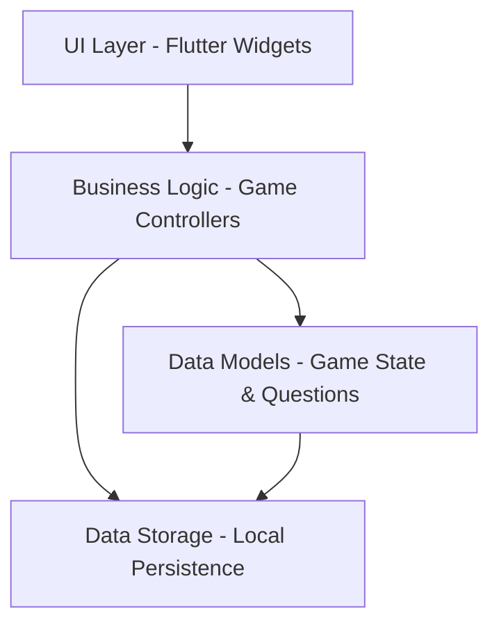
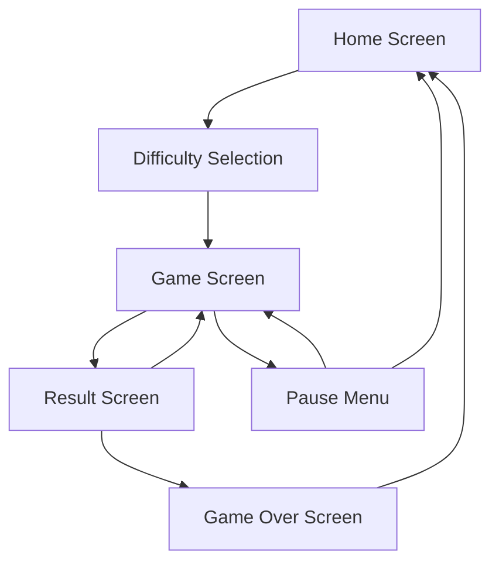

# Design Document

## Overview

DogDog is a Flutter-based mobile trivia game that provides an engaging, educational experience about dogs for children aged 8-12. The application follows a clean, colorful design with intuitive navigation and child-friendly interactions. The game implements a progressive difficulty system with achievements, power-ups, and engaging feedback mechanisms to maintain player interest and learning.

## Architecture

### High-Level Architecture



### Application Structure

The application follows a layered architecture pattern:

- **Presentation Layer**: Flutter widgets and screens
- **Business Logic Layer**: Game controllers and state management
- **Data Layer**: Models, repositories, and local storage
- **Services Layer**: Audio, animations, and utility services

### State Management

The application uses Provider pattern for state management to handle:
- Game state (current question, score, lives, level)
- Player progress (achievements, unlocked content)
- Settings and preferences
- Power-up inventory

## Components and Interfaces

### Core Components

#### 1. Game Engine (`GameController`)
- Manages game flow and state transitions
- Handles question selection with adaptive difficulty
- Processes player answers and scoring
- Manages lives and game over conditions

#### 2. Question Manager (`QuestionService`)
- Loads and manages question pools by difficulty
- Implements adaptive difficulty algorithm
- Provides question selection logic
- Manages fun facts and explanations

#### 3. Progress Tracker (`ProgressService`)
- Tracks player statistics and achievements
- Manages rank progression
- Handles daily challenges
- Persists player data locally

#### 4. Power-up System (`PowerUpController`)
- Manages power-up inventory and usage
- Implements power-up effects during gameplay
- Handles power-up earning mechanics

#### 5. UI Components
- **HomeScreen**: Welcome screen with logo and start button
- **DifficultySelectionScreen**: Category selection (Leicht, Mittel, Schwer, Experte)
- **GameScreen**: Main quiz interface with question, answers, and UI elements
- **ResultScreen**: Feedback screen with fun facts
- **GameOverScreen**: End game screen with final score and achievements
- **AchievementsScreen**: Display earned ranks and progress

### Screen Flow



## Data Models

### Core Models

#### Question Model
```dart
class Question {
  final String id;
  final String text;
  final List<String> answers;
  final int correctAnswerIndex;
  final String funFact;
  final Difficulty difficulty;
  final String category;
  final String? hint;
}
```

#### GameState Model
```dart
class GameState {
  final int currentQuestionIndex;
  final int score;
  final int lives;
  final int streak;
  final int level;
  final List<Question> questions;
  final Map<PowerUpType, int> powerUps;
  final bool isGameActive;
  final int timeRemaining;
}
```

#### PlayerProgress Model
```dart
class PlayerProgress {
  final int totalCorrectAnswers;
  final Rank currentRank;
  final List<Achievement> unlockedAchievements;
  final Map<String, bool> unlockedContent;
  final int dailyChallengeStreak;
  final DateTime lastPlayDate;
}
```

#### Achievement Model
```dart
class Achievement {
  final String id;
  final String name;
  final String description;
  final String iconPath;
  final int requiredCorrectAnswers;
  final bool isUnlocked;
  final DateTime? unlockedDate;
}
```

### Enums

```dart
enum Difficulty { easy, medium, hard, expert }
enum PowerUpType { fiftyFifty, hint, extraTime, skip, secondChance }
enum Rank { chihuahua, pug, cockerSpaniel, germanShepherd, greatDane }
enum GameResult { win, lose, quit }
```

## User Interface Design

### Design System

#### Color Palette
- Primary Blue: #4A90E2 (DogDog logo blue)
- Secondary Purple: #8B5CF6 (buttons and accents)
- Success Green: #10B981 (correct answers)
- Error Red: #EF4444 (incorrect answers)
- Warning Yellow: #F59E0B (hints and warnings)
- Background Gray: #F8FAFC
- Text Dark: #1F2937
- Text Light: #6B7280

#### Typography
- Headers: Bold, 24-28px
- Body Text: Regular, 16-18px
- Button Text: Medium, 16-18px
- Small Text: Regular, 14px

#### Component Specifications

**Buttons**
- Large rounded buttons (height: 56px)
- Purple gradient background (#8B5CF6 to #7C3AED)
- White text with medium weight
- Subtle shadow and press animations

**Cards**
- Rounded corners (12px radius)
- Subtle shadow (elevation: 2)
- White background with colored accents
- Padding: 16-20px

**Answer Choices**
- Full-width buttons with rounded corners
- Light background with colored border
- Hover/press states with color changes
- Icons for visual feedback

### Screen Layouts

#### Home Screen
- Centered DogDog logo (blue circular icon)
- Welcome text in German
- Game rules explanation
- Large "Quiz starten" button
- Information cards about features
- Achievement progress display

#### Difficulty Selection Screen
- Grid layout with 4 difficulty cards
- Each card shows difficulty name, description, and icon
- Color-coded difficulty levels
- "Diese Kategorie wählen" buttons

#### Game Screen
- Question text at top
- Four answer buttons in 2x2 grid
- Lives display (heart icons) in top-left
- Score display in top-right
- Timer bar (when applicable)
- Power-up buttons at bottom

#### Result Screen
- Large feedback message (correct/incorrect)
- Fun fact display in colored card
- Score update animation
- "Next Question" button
- Lives remaining indicator

## Error Handling

### Error Categories

#### 1. Data Loading Errors
- Question loading failures
- Progress save/load errors
- Asset loading issues

#### 2. Game State Errors
- Invalid state transitions
- Corrupted game data
- Timer synchronization issues

#### 3. UI Errors
- Navigation failures
- Animation interruptions
- Input validation errors

### Error Recovery Strategies

- **Graceful Degradation**: Continue with default content when data loading fails
- **State Recovery**: Restore previous valid game state on corruption
- **User Feedback**: Clear, child-friendly error messages
- **Retry Mechanisms**: Automatic retry for transient failures
- **Offline Fallback**: Local question cache for network issues

## Testing Strategy

### Unit Testing
- Game logic and scoring algorithms
- Question selection and difficulty adaptation
- Achievement and progress tracking
- Power-up functionality
- Data model validation

### Widget Testing
- Screen navigation and transitions
- Button interactions and feedback
- Animation and timer functionality
- State management and UI updates
- Accessibility features

### Integration Testing
- Complete game flow testing
- Data persistence and retrieval
- Cross-platform compatibility
- Performance under various conditions
- Memory usage and optimization

### User Acceptance Testing
- Child-friendly interface validation
- Game difficulty progression
- Achievement satisfaction
- Overall user experience
- Accessibility compliance

## Performance Considerations

### Optimization Strategies

#### Memory Management
- Efficient question caching
- Image and asset optimization
- Proper widget disposal
- Memory leak prevention

#### Rendering Performance
- Smooth animations (60 FPS target)
- Efficient list rendering
- Image caching and compression
- Minimal widget rebuilds

#### Battery Optimization
- Efficient timer implementation
- Background processing limits
- Screen brightness considerations
- CPU usage optimization

### Platform-Specific Considerations

#### iOS
- Safe area handling
- iOS-specific animations
- App Store compliance
- iOS accessibility features

#### Android
- Material Design compliance
- Android-specific navigation
- Various screen sizes support
- Android accessibility features

## Localization Support

### German Language Implementation
- All UI text in German as shown in mockups
- German-specific formatting (numbers, dates)
- Cultural considerations for content
- German dog breed names and facts

### Future Localization
- Internationalization framework setup
- Extractable text strings
- Locale-specific assets
- RTL language support preparation

## Security and Privacy

### Child Safety
- No personal data collection
- Local-only data storage
- No external communications
- COPPA compliance considerations

### Data Protection
- Encrypted local storage
- No analytics tracking
- Minimal permissions required
- Secure coding practices