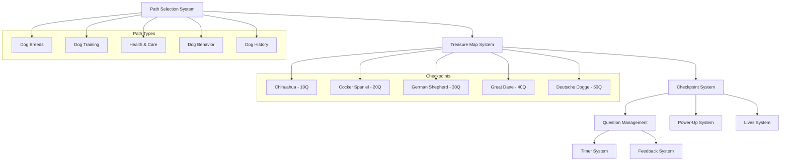

# Design Document

## Overview

The game mechanics improvements transform DogDog from a simple difficulty-based quiz into an engaging treasure map adventure with themed learning paths. This design replaces the current easy/medium/hard/expert selection with 5 topic-based paths where players progress through dog breed checkpoints every 10 questions. The system includes checkpoint fallback on failure, balanced power-up distribution, accurate lives display, persistent timer functionality, and enhanced engagement mechanics.

## Architecture

### Core System Architecture



### Data Flow Architecture

The system follows a checkpoint-driven progression model where each component maintains state relative to the current checkpoint and path:

- **Path Selection**: Determines question pool and difficulty progression
- **Treasure Map**: Visualizes progress and manages checkpoint unlocking
- **Checkpoint System**: Handles progress saving, power-up distribution, and fallback logic
- **Question Management**: Ensures no repeats and proper shuffling per checkpoint
- **Power-Up System**: Distributes all 5 power-up types based on checkpoint achievements

## Components and Interfaces

### Path Selection System

#### PathType Enum
```dart
enum PathType {
  dogBreeds,
  dogTraining,
  healthCare,
  dogBehavior,
  dogHistory;
  
  String get displayName {
    switch (this) {
      case PathType.dogBreeds:
        return 'Dog Breeds';
      case PathType.dogTraining:
        return 'Dog Training';
      case PathType.healthCare:
        return 'Health & Care';
      case PathType.dogBehavior:
        return 'Dog Behavior';
      case PathType.dogHistory:
        return 'Dog History';
    }
  }
  
  String get description {
    switch (this) {
      case PathType.dogBreeds:
        return 'Learn about different dog breeds, their characteristics, and origins';
      case PathType.dogTraining:
        return 'Master dog training techniques, commands, and behavioral guidance';
      case PathType.healthCare:
        return 'Understand dog health, nutrition, and medical care';
      case PathType.dogBehavior:
        return 'Explore dog psychology, instincts, and behavioral patterns';
      case PathType.dogHistory:
        return 'Discover the history of dogs, genetics, and evolution';
    }
  }
}
```

#### PathSelectionController
```dart
class PathSelectionController extends ChangeNotifier {
  PathType? _selectedPath;
  Map<PathType, bool> _unlockedPaths = {
    PathType.dogBreeds: true, // Always unlocked
    PathType.dogTraining: false,
    PathType.healthCare: false,
    PathType.dogBehavior: false,
    PathType.dogHistory: false,
  };
  
  PathType? get selectedPath => _selectedPath;
  Map<PathType, bool> get unlockedPaths => Map.unmodifiable(_unlockedPaths);
  
  void selectPath(PathType path);
  void unlockPath(PathType path);
  bool isPathUnlocked(PathType path);
  void resetPaths();
}
```

### Treasure Map System

#### Checkpoint Enum
```dart
enum Checkpoint {
  chihuahua(10, 'Chihuahua', 'assets/images/chihuahua.png'),
  cockerSpaniel(20, 'Cocker Spaniel', 'assets/images/cocker.png'),
  germanShepherd(30, 'German Shepherd', 'assets/images/schaeferhund.png'),
  greatDane(40, 'Great Dane', 'assets/images/dogge.png'),
  deutscheDogge(50, 'Deutsche Dogge', 'assets/images/dogge.png');
  
  const Checkpoint(this.questionsRequired, this.displayName, this.imagePath);
  
  final int questionsRequired;
  final String displayName;
  final String imagePath;
}
```

#### TreasureMapController
```dart
class TreasureMapController extends ChangeNotifier {
  PathType _currentPath;
  int _currentQuestionCount = 0;
  Checkpoint? _lastCompletedCheckpoint;
  Set<Checkpoint> _completedCheckpoints = {};
  
  PathType get currentPath => _currentPath;
  int get currentQuestionCount => _currentQuestionCount;
  Checkpoint? get lastCompletedCheckpoint => _lastCompletedCheckpoint;
  Set<Checkpoint> get completedCheckpoints => Set.unmodifiable(_completedCheckpoints);
  
  Checkpoint? get nextCheckpoint;
  int get questionsToNextCheckpoint;
  double get progressToNextCheckpoint;
  bool get isPathCompleted;
  
  void initializePath(PathType path);
  void incrementQuestionCount();
  void completeCheckpoint(Checkpoint checkpoint);
  void resetToCheckpoint(Checkpoint checkpoint);
  void resetPath();
}
```

### Enhanced Game Controller

#### Updated GameController
```dart
class GameController extends ChangeNotifier {
  // Existing properties...
  final TreasureMapController _treasureMapController;
  final CheckpointSystem _checkpointSystem;
  Set<String> _answeredQuestionIds = {};
  
  // New properties for treasure map system
  PathType get currentPath => _treasureMapController.currentPath;
  Checkpoint? get nextCheckpoint => _treasureMapController.nextCheckpoint;
  int get questionsToNextCheckpoint => _treasureMapController.questionsToNextCheckpoint;
  double get progressToNextCheckpoint => _treasureMapController.progressToNextCheckpoint;
  
  // Enhanced initialization
  Future<void> initializePathGame({
    required PathType path,
    Checkpoint? startFromCheckpoint,
  });
  
  // Checkpoint management
  void handleCheckpointReached(Checkpoint checkpoint);
  void handleGameOver();
  void restartFromLastCheckpoint();
  
  // Question management with no-repeat logic
  List<Question> getShuffledQuestionsForPath(PathType path, int count);
  bool hasQuestionBeenAnswered(String questionId);
  void markQuestionAsAnswered(String questionId);
}
```

### Power-Up Distribution System

#### CheckpointRewards
```dart
class CheckpointRewards {
  static Map<PowerUpType, int> getRewardsForCheckpoint(
    Checkpoint checkpoint,
    double accuracy,
  ) {
    final baseRewards = _getBaseRewards(checkpoint);
    final bonusRewards = _getBonusRewards(checkpoint, accuracy);
    
    // Merge base and bonus rewards
    final totalRewards = <PowerUpType, int>{};
    for (final type in PowerUpType.values) {
      totalRewards[type] = (baseRewards[type] ?? 0) + (bonusRewards[type] ?? 0);
    }
    
    return totalRewards;
  }
  
  static Map<PowerUpType, int> _getBaseRewards(Checkpoint checkpoint) {
    switch (checkpoint) {
      case Checkpoint.chihuahua:
        return {
          PowerUpType.fiftyFifty: 2,
          PowerUpType.hint: 2,
          PowerUpType.extraTime: 1,
          PowerUpType.skip: 0,
          PowerUpType.secondChance: 0,
        };
      case Checkpoint.cockerSpaniel:
        return {
          PowerUpType.fiftyFifty: 2,
          PowerUpType.hint: 2,
          PowerUpType.extraTime: 2,
          PowerUpType.skip: 1,
          PowerUpType.secondChance: 0,
        };
      case Checkpoint.germanShepherd:
        return {
          PowerUpType.fiftyFifty: 2,
          PowerUpType.hint: 2,
          PowerUpType.extraTime: 2,
          PowerUpType.skip: 2,
          PowerUpType.secondChance: 1,
        };
      case Checkpoint.greatDane:
        return {
          PowerUpType.fiftyFifty: 3,
          PowerUpType.hint: 3,
          PowerUpType.extraTime: 3,
          PowerUpType.skip: 3,
          PowerUpType.secondChance: 3,
        };
      case Checkpoint.deutscheDogge:
        return {
          PowerUpType.fiftyFifty: 4,
          PowerUpType.hint: 4,
          PowerUpType.extraTime: 4,
          PowerUpType.skip: 4,
          PowerUpType.secondChance: 4,
        };
    }
  }
  
  static Map<PowerUpType, int> _getBonusRewards(
    Checkpoint checkpoint,
    double accuracy,
  ) {
    if (accuracy >= 0.8) {
      // 80%+ accuracy gets bonus power-ups including skip and secondChance
      return {
        PowerUpType.fiftyFifty: 1,
        PowerUpType.hint: 1,
        PowerUpType.extraTime: 1,
        PowerUpType.skip: 1,
        PowerUpType.secondChance: 1,
      };
    }
    return {};
  }
}
```

### Lives System Fix

#### LivesController
```dart
class LivesController extends ChangeNotifier {
  int _currentLives = 3;
  final int _maxLives = 3;
  
  int get currentLives => _currentLives;
  int get maxLives => _maxLives;
  bool get isGameOver => _currentLives <= 0;
  
  void loseLife() {
    if (_currentLives > 0) {
      _currentLives--;
      notifyListeners();
    }
  }
  
  void restoreLife() {
    if (_currentLives < _maxLives) {
      _currentLives++;
      notifyListeners();
    }
  }
  
  void resetLives() {
    _currentLives = _maxLives;
    notifyListeners();
  }
  
  // Generate heart icons based on actual lives count
  List<Widget> generateHeartIcons() {
    return List.generate(_maxLives, (index) {
      return Icon(
        index < _currentLives
            ? Icons.favorite_rounded
            : Icons.favorite_border_rounded,
        color: ModernColors.error,
        size: 18,
      );
    });
  }
}
```

### Enhanced Timer System

#### PersistentTimerController
```dart
class PersistentTimerController extends ChangeNotifier {
  Timer? _timer;
  int _timeRemaining = 0;
  int _totalTime = 0;
  bool _isActive = false;
  bool _isPaused = false;
  VoidCallback? _onTimeExpired;
  
  int get timeRemaining => _timeRemaining;
  int get totalTime => _totalTime;
  bool get isActive => _isActive;
  bool get isPaused => _isPaused;
  double get progress => _totalTime > 0 ? _timeRemaining / _totalTime : 0.0;
  
  void startTimer({
    required int seconds,
    required VoidCallback onTimeExpired,
  }) {
    _stopTimer();
    _timeRemaining = seconds;
    _totalTime = seconds;
    _isActive = true;
    _isPaused = false;
    _onTimeExpired = onTimeExpired;
    
    _timer = Timer.periodic(const Duration(seconds: 1), _onTick);
    notifyListeners();
  }
  
  void pauseTimer() {
    if (_isActive && !_isPaused) {
      _timer?.cancel();
      _isPaused = true;
      notifyListeners();
    }
  }
  
  void resumeTimer() {
    if (_isActive && _isPaused && _timeRemaining > 0) {
      _isPaused = false;
      _timer = Timer.periodic(const Duration(seconds: 1), _onTick);
      notifyListeners();
    }
  }
  
  void addTime(int seconds) {
    if (_isActive) {
      _timeRemaining += seconds;
      notifyListeners();
    }
  }
  
  void _onTick(Timer timer) {
    if (_timeRemaining > 0) {
      _timeRemaining--;
      notifyListeners();
      
      // Warning at 30% remaining
      if (_timeRemaining <= (_totalTime * 0.3).round() && _timeRemaining > 0) {
        _triggerWarning();
      }
    } else {
      _stopTimer();
      _onTimeExpired?.call();
    }
  }
  
  void _triggerWarning() {
    // Trigger visual and audio warning
    AudioService().playTimerWarningSound();
  }
  
  void _stopTimer() {
    _timer?.cancel();
    _timer = null;
    _isActive = false;
    _isPaused = false;
  }
}
```

## Data Models

### Path Progress Model
```dart
class PathProgress {
  final PathType pathType;
  final int questionsAnswered;
  final int correctAnswers;
  final Set<Checkpoint> completedCheckpoints;
  final Checkpoint? lastCompletedCheckpoint;
  final Set<String> answeredQuestionIds;
  final Map<PowerUpType, int> earnedPowerUps;
  final DateTime lastPlayedAt;
  
  const PathProgress({
    required this.pathType,
    required this.questionsAnswered,
    required this.correctAnswers,
    required this.completedCheckpoints,
    this.lastCompletedCheckpoint,
    required this.answeredQuestionIds,
    required this.earnedPowerUps,
    required this.lastPlayedAt,
  });
  
  double get accuracy => questionsAnswered > 0 ? correctAnswers / questionsAnswered : 0.0;
  bool get isCompleted => completedCheckpoints.contains(Checkpoint.deutscheDogge);
  
  PathProgress copyWith({...});
  Map<String, dynamic> toJson();
  factory PathProgress.fromJson(Map<String, dynamic> json);
}
```

### Game Session Model
```dart
class GameSession {
  final PathType currentPath;
  final int currentQuestionIndex;
  final int questionsInCurrentSegment;
  final Checkpoint? targetCheckpoint;
  final int livesRemaining;
  final int currentScore;
  final int currentStreak;
  final Map<PowerUpType, int> availablePowerUps;
  final Set<String> answeredQuestionIds;
  final bool isTimerActive;
  final int timeRemaining;
  
  const GameSession({
    required this.currentPath,
    required this.currentQuestionIndex,
    required this.questionsInCurrentSegment,
    this.targetCheckpoint,
    required this.livesRemaining,
    required this.currentScore,
    required this.currentStreak,
    required this.availablePowerUps,
    required this.answeredQuestionIds,
    required this.isTimerActive,
    required this.timeRemaining,
  });
  
  bool get isAtCheckpoint => questionsInCurrentSegment % 10 == 0;
  int get questionsToNextCheckpoint => 10 - (questionsInCurrentSegment % 10);
  
  GameSession copyWith({...});
  Map<String, dynamic> toJson();
  factory GameSession.fromJson(Map<String, dynamic> json);
}
```

## User Interface Design

### Path Selection Screen
```dart
class PathSelectionScreen extends StatelessWidget {
  @override
  Widget build(BuildContext context) {
    return Scaffold(
      body: Container(
        decoration: BoxDecoration(
          gradient: LinearGradient(colors: ModernColors.backgroundGradient),
        ),
        child: SafeArea(
          child: Column(
            children: [
              // Header with treasure map theme
              _buildHeader(),
              
              // Path selection cards
              Expanded(
                child: ListView.builder(
                  padding: ModernSpacing.paddingLG,
                  itemCount: PathType.values.length,
                  itemBuilder: (context, index) {
                    final pathType = PathType.values[index];
                    return _buildPathCard(pathType);
                  },
                ),
              ),
            ],
          ),
        ),
      ),
    );
  }
  
  Widget _buildPathCard(PathType pathType) {
    return ModernCard(
      margin: ModernSpacing.paddingVerticalSM,
      child: ListTile(
        leading: _getPathIcon(pathType),
        title: Text(pathType.displayName),
        subtitle: Text(pathType.description),
        trailing: Icon(Icons.arrow_forward_ios),
        onTap: () => _selectPath(pathType),
      ),
    );
  }
}
```

### Treasure Map Screen
```dart
class TreasureMapScreen extends StatelessWidget {
  final PathType pathType;
  final TreasureMapController controller;
  
  @override
  Widget build(BuildContext context) {
    return Scaffold(
      body: Container(
        decoration: BoxDecoration(
          gradient: LinearGradient(colors: ModernColors.backgroundGradient),
        ),
        child: SafeArea(
          child: Column(
            children: [
              // Path title and progress
              _buildPathHeader(),
              
              // Treasure map visualization
              Expanded(
                child: _buildTreasureMap(),
              ),
              
              // Start/Continue button
              _buildActionButton(),
            ],
          ),
        ),
      ),
    );
  }
  
  Widget _buildTreasureMap() {
    return CustomPaint(
      painter: TreasureMapPainter(
        completedCheckpoints: controller.completedCheckpoints,
        currentProgress: controller.progressToNextCheckpoint,
        nextCheckpoint: controller.nextCheckpoint,
      ),
      child: Container(
        width: double.infinity,
        height: double.infinity,
        child: Stack(
          children: _buildCheckpointMarkers(),
        ),
      ),
    );
  }
  
  List<Widget> _buildCheckpointMarkers() {
    return Checkpoint.values.map((checkpoint) {
      final isCompleted = controller.completedCheckpoints.contains(checkpoint);
      final isCurrent = controller.nextCheckpoint == checkpoint;
      
      return Positioned(
        left: _getCheckpointX(checkpoint),
        top: _getCheckpointY(checkpoint),
        child: CheckpointMarker(
          checkpoint: checkpoint,
          isCompleted: isCompleted,
          isCurrent: isCurrent,
          progress: isCurrent ? controller.progressToNextCheckpoint : 0.0,
        ),
      );
    }).toList();
  }
}
```

### Enhanced Game Screen
The game screen will be updated to show:
- Current path and checkpoint progress
- Accurate lives display (3 hearts max)
- Persistent timer with warning states
- All 5 power-ups with proper availability
- Progress indicator toward next checkpoint

### Checkpoint Celebration Screen
```dart
class CheckpointCelebrationScreen extends StatefulWidget {
  final Checkpoint completedCheckpoint;
  final Map<PowerUpType, int> earnedPowerUps;
  final int questionsAnswered;
  final double accuracy;
  
  @override
  Widget build(BuildContext context) {
    return Scaffold(
      body: Container(
        decoration: BoxDecoration(
          gradient: LinearGradient(colors: ModernColors.celebrationGradient),
        ),
        child: SafeArea(
          child: Column(
            mainAxisAlignment: MainAxisAlignment.center,
            children: [
              // Checkpoint achievement animation
              _buildCheckpointAnimation(),
              
              // Achievement details
              _buildAchievementDetails(),
              
              // Power-up rewards
              _buildPowerUpRewards(),
              
              // Continue button
              _buildContinueButton(),
            ],
          ),
        ),
      ),
    );
  }
}
```

## Error Handling

### Checkpoint Fallback System
```dart
class CheckpointFallbackHandler {
  static void handleGameOver(GameController gameController) {
    final lastCheckpoint = gameController.treasureMapController.lastCompletedCheckpoint;
    
    if (lastCheckpoint != null) {
      // Reset to last checkpoint
      gameController.restartFromCheckpoint(lastCheckpoint);
      _showFallbackMessage(lastCheckpoint);
    } else {
      // No checkpoints reached, restart from beginning
      gameController.restartPath();
      _showRestartMessage();
    }
  }
  
  static void _showFallbackMessage(Checkpoint checkpoint) {
    // Show user-friendly message about checkpoint restart
  }
  
  static void _showRestartMessage() {
    // Show message about path restart
  }
}
```

### Question Pool Management
```dart
class QuestionPoolManager {
  static List<Question> getShuffledQuestions({
    required PathType pathType,
    required Set<String> excludeQuestionIds,
    required int count,
    required int difficultyLevel,
  }) {
    // Get all questions for the path
    final allQuestions = _getQuestionsForPath(pathType);
    
    // Filter out already answered questions
    final availableQuestions = allQuestions
        .where((q) => !excludeQuestionIds.contains(q.id))
        .toList();
    
    // Apply difficulty filtering based on progress
    final filteredQuestions = _filterByDifficulty(
      availableQuestions,
      difficultyLevel,
    );
    
    // Shuffle and return requested count
    filteredQuestions.shuffle();
    return filteredQuestions.take(count).toList();
  }
}
```

## Testing Strategy

### Unit Testing
- Test checkpoint progression logic
- Test power-up distribution algorithms
- Test lives display synchronization
- Test timer persistence and warnings
- Test question pool management and no-repeat logic

### Integration Testing
- Test complete path progression from start to Deutsche Dogge
- Test checkpoint fallback scenarios
- Test power-up usage across checkpoints
- Test timer behavior during game state changes
- Test question shuffling and exclusion logic

### User Experience Testing
- Test treasure map visualization and interaction
- Test checkpoint celebration animations
- Test fallback user experience
- Test power-up availability and usage patterns
- Test overall engagement and progression satisfaction

## Implementation Considerations

### Performance Optimization
- Lazy load questions for each path
- Cache checkpoint progress locally
- Optimize treasure map rendering
- Efficient question exclusion algorithms

### Data Persistence
- Save path progress and checkpoints
- Persist answered question IDs
- Store power-up inventory across sessions
- Maintain timer state during app lifecycle changes

### Accessibility
- Screen reader support for treasure map
- Clear checkpoint progress announcements
- Accessible power-up availability indicators
- Timer warnings for visually impaired users

### Localization
- Translatable path names and descriptions
- Localized checkpoint celebration messages
- Culturally appropriate treasure map themes
- Localized power-up descriptions and feedback