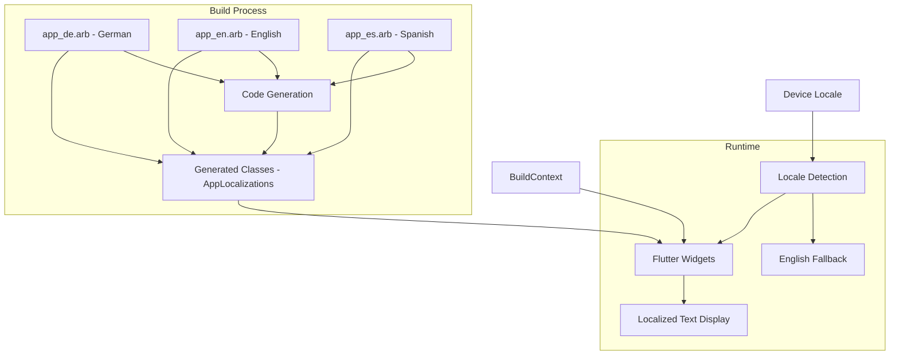

# Design Document

## Overview

This design document outlines the implementation of proper Flutter localization (l10n) for the DogDog Trivia Game. The solution will implement automatic locale detection to display the app in German, English, or Spanish based on the user's device settings, with English as the fallback for unsupported locales. The system is designed for easy extension to additional languages in the future.

## Architecture

### Localization Framework Architecture



### Integration with Existing Architecture

The localization system will integrate seamlessly with the existing DogDog architecture:

- **Presentation Layer**: Widgets will use `AppLocalizations.of(context)` to access translated strings
- **Controller Layer**: Controllers will pass localization context when needed for dynamic messages
- **Service Layer**: Services will use localized strings for error messages and notifications
- **Model Layer**: Models will remain language-agnostic, with display names handled in the presentation layer

## Components and Interfaces

### Core Localization Components

#### 1. ARB Files Structure
```
lib/l10n/
├── app_de.arb          # German translations
├── app_en.arb          # English translations (fallback)
├── app_es.arb          # Spanish translations
└── README.md           # Localization documentation
```

#### 2. Generated Localization Classes
Flutter will automatically generate:
- `AppLocalizations` - Main localization class
- `AppLocalizationsEn` - English implementation
- `AppLocalizations De` - German implementation
- `AppLocalizationsEs` - Spanish implementation

#### 3. Localization Delegate Setup
```dart
MaterialApp(
  localizationsDelegates: const [
    AppLocalizations.delegate,
    GlobalMaterialLocalizations.delegate,
    GlobalWidgetsLocalizations.delegate,
    GlobalCupertinoLocalizations.delegate,
  ],
  supportedLocales: const [
    Locale('de'), // German
    Locale('en'), // English (fallback)
    Locale('es'), // Spanish
  ],
  // Automatic locale detection - no hardcoded locale
  // Flutter will automatically select based on device locale
  // ... rest of app configuration
)
```

### String Organization Strategy

#### 1. Hierarchical Key Structure
```json
{
  "homeScreen_welcomeTitle": "Willkommen bei DogDog!",
  "homeScreen_welcomeSubtitle": "Teste dein Wissen über Hunde in diesem lustigen Quiz!",
  "homeScreen_startButton": "Quiz starten",
  "homeScreen_achievementsButton": "Erfolge",
  
  "difficultyScreen_title": "Schwierigkeitsgrad wählen",
  "difficultyScreen_easy": "Leicht",
  "difficultyScreen_medium": "Mittel",
  "difficultyScreen_hard": "Schwer",
  "difficultyScreen_expert": "Experte",
  
  "gameScreen_score": "Punkte",
  "gameScreen_lives": "Leben",
  "gameScreen_timeRemaining": "Verbleibende Zeit",
  
  "achievements_chihuahua": "Chihuahua",
  "achievements_pug": "Mops",
  "achievements_cockerSpaniel": "Cocker Spaniel",
  "achievements_germanShepherd": "Deutscher Schäferhund",
  "achievements_greatDane": "Deutsche Dogge"
}
```

#### 2. Feature-Based Grouping
- `homeScreen_*` - Home screen related strings
- `difficultyScreen_*` - Difficulty selection strings
- `gameScreen_*` - Game play interface strings
- `resultScreen_*` - Result and feedback strings
- `achievements_*` - Achievement and rank strings
- `powerUps_*` - Power-up related strings
- `errors_*` - Error messages and recovery
- `common_*` - Shared/common strings

## Data Models

### Localization Key Conventions

#### 1. Naming Convention
```dart
// Pattern: {screen}_{component}_{variant?}
homeScreen_welcomeTitle
gameScreen_correctAnswer_celebration
errors_network_retry
common_button_cancel
```

#### 2. ARB File Structure
```json
{
  "@@locale": "de",
  "@@last_modified": "2025-02-08T12:00:00.000Z",
  
  "homeScreen_welcomeTitle": "Willkommen bei DogDog!",
  "@homeScreen_welcomeTitle": {
    "description": "Main welcome title on the home screen"
  },
  
  "gameScreen_questionCounter": "Frage {current} von {total}",
  "@gameScreen_questionCounter": {
    "description": "Shows current question number out of total",
    "placeholders": {
      "current": {
        "type": "int",
        "example": "5"
      },
      "total": {
        "type": "int", 
        "example": "10"
      }
    }
  }
}
```

### Translation Mapping

#### 1. Multi-Language Translation Table

| English | German | Spanish | Context |
|---------|--------|---------|---------|
| "Welcome to DogDog!" | "Willkommen bei DogDog!" | "¡Bienvenido a DogDog!" | Home screen title |
| "Test your knowledge about dogs" | "Teste dein Wissen über Hunde" | "Pon a prueba tus conocimientos sobre perros" | Home screen subtitle |
| "Start Quiz" | "Quiz starten" | "Comenzar Quiz" | Main action button |
| "Achievements" | "Erfolge" | "Logros" | Navigation button |
| "Fun Questions" | "Lustige Fragen" | "Preguntas Divertidas" | Info card title |
| "Educational" | "Lehrreich" | "Educativo" | Info card title |
| "Progress Tracking" | "Fortschritt verfolgen" | "Seguimiento del Progreso" | Info card title |
| "Your Progress" | "Dein Fortschritt" | "Tu Progreso" | Progress section |
| "Current Rank" | "Aktueller Rang" | "Rango Actual" | Achievement display |

#### 2. Game-Specific Terminology

| English | German | Spanish | Notes |
|---------|--------|---------|-------|
| Lives | Leben | Vidas | Displayed as hearts |
| Score | Punkte | Puntuación | Point counter |
| Streak | Serie | Racha | Consecutive correct answers |
| Power-up | Power-up | Potenciador | Keep consistent across languages |
| Hint | Hinweis | Pista | Help feature |
| Skip | Überspringen | Saltar | Skip question |
| Time's up! | Zeit ist um! | ¡Se acabó el tiempo! | Timer expiry |
| Correct! | Richtig! | ¡Correcto! | Positive feedback |
| Incorrect | Falsch | Incorrecto | Negative feedback |

## User Interface Design

### Localization Integration Points

#### 1. Text Widget Updates
```dart
// Before (hardcoded)
Text('Welcome to DogDog!')

// After (localized)
Text(AppLocalizations.of(context)!.homeScreen_welcomeTitle)
```

#### 2. Button Label Updates
```dart
// Before
ElevatedButton(
  onPressed: () => {},
  child: Text('Start Quiz'),
)

// After
ElevatedButton(
  onPressed: () => {},
  child: Text(AppLocalizations.of(context)!.homeScreen_startButton),
)
```

#### 3. Dynamic Text with Parameters
```dart
// For strings with placeholders
Text(AppLocalizations.of(context)!.gameScreen_questionCounter(5, 10))
// Renders: "Frage 5 von 10"
```

### Screen-by-Screen Localization Plan

#### 1. Home Screen (`home_screen.dart`)
- Welcome title and subtitle
- Start button and navigation buttons
- Info card titles and descriptions
- Progress section labels

#### 2. Difficulty Selection (`difficulty_selection_screen.dart`)
- Screen title
- Difficulty level names and descriptions
- Selection button labels

#### 3. Game Screen (`game_screen.dart`)
- UI labels (Score, Lives, Time)
- Power-up button labels
- Question counter display

#### 4. Result Screen (`result_screen.dart`)
- Feedback messages (Correct/Incorrect)
- Fun fact introduction text
- Navigation button labels

#### 5. Achievement Screen (`achievements_screen.dart`)
- Screen title
- Rank names and descriptions
- Progress indicators

## Error Handling

### Localization Error Scenarios

#### 1. Missing Translation Keys
```dart
// Fallback mechanism
String getLocalizedString(String key) {
  try {
    return AppLocalizations.of(context)!.getString(key);
  } catch (e) {
    // Log error and return key as fallback
    debugPrint('Missing localization key: $key');
    return key;
  }
}
```

#### 2. Context Availability Issues
```dart
// Safe localization access
extension SafeLocalization on BuildContext {
  AppLocalizations? get l10n => AppLocalizations.of(this);
  
  String localizedString(String Function(AppLocalizations) getter) {
    final localizations = l10n;
    if (localizations != null) {
      return getter(localizations);
    }
    return 'Translation not available';
  }
}
```

#### 3. Placeholder Parameter Mismatches
- Validate parameter counts in ARB files
- Provide clear error messages for developers
- Use type-safe parameter passing

## Testing Strategy

### Localization Testing Approach

#### 1. Unit Tests for Localization
```dart
testWidgets('Home screen displays German text', (WidgetTester tester) async {
  await tester.pumpWidget(
    MaterialApp(
      localizationsDelegates: AppLocalizations.localizationsDelegates,
      supportedLocales: AppLocalizations.supportedLocales,
      locale: const Locale('de'),
      home: const HomeScreen(),
    ),
  );
  
  expect(find.text('Willkommen bei DogDog!'), findsOneWidget);
  expect(find.text('Quiz starten'), findsOneWidget);
});

testWidgets('Home screen displays Spanish text', (WidgetTester tester) async {
  await tester.pumpWidget(
    MaterialApp(
      localizationsDelegates: AppLocalizations.localizationsDelegates,
      supportedLocales: AppLocalizations.supportedLocales,
      locale: const Locale('es'),
      home: const HomeScreen(),
    ),
  );
  
  expect(find.text('¡Bienvenido a DogDog!'), findsOneWidget);
  expect(find.text('Comenzar Quiz'), findsOneWidget);
});
```

#### 2. Widget Tests for All Screens
- Verify localized text appears correctly in German, English, and Spanish
- Test placeholder parameter substitution for all languages
- Validate accessibility labels work with all supported languages

#### 3. Integration Tests
- Complete app flow with each supported locale (de, en, es)
- Screen navigation with consistent language across all screens
- Error scenarios with localized messages in appropriate language

#### 4. Golden Tests for Visual Verification
- Screenshot tests with text in all three languages
- Layout verification with varying string lengths across languages
- Font rendering validation for all supported locales

## Performance Considerations

### Optimization Strategies

#### 1. Lazy Loading
- Localization delegates load only when needed
- ARB files are compiled into efficient binary format
- Generated classes use const constructors where possible

#### 2. Memory Management
- Localization instances are cached by Flutter
- String interpolation is optimized by the framework
- No runtime parsing of ARB files

#### 3. Build Time Optimization
- Code generation happens at build time
- No runtime reflection or dynamic loading
- Type-safe string access with compile-time validation

## Migration Strategy

### Implementation Phases

#### Phase 1: Setup and Infrastructure
1. Add Flutter localization dependencies
2. Configure build system for code generation
3. Create initial ARB files with German translations
4. Update MaterialApp configuration

#### Phase 2: Screen-by-Screen Migration
1. Home Screen localization
2. Difficulty Selection Screen
3. Game Screen UI elements
4. Result and Achievement screens
5. Error messages and dialogs

#### Phase 3: Testing and Validation
1. Comprehensive test suite updates
2. Visual regression testing
3. Accessibility testing with German text
4. Performance validation

#### Phase 4: Documentation and Cleanup
1. Remove hardcoded English strings
2. Update code documentation
3. Create localization guidelines
4. Prepare for future language additions

### Backward Compatibility

- Maintain existing functionality during migration
- Gradual replacement of hardcoded strings
- Fallback mechanisms for missing translations
- No breaking changes to existing APIs