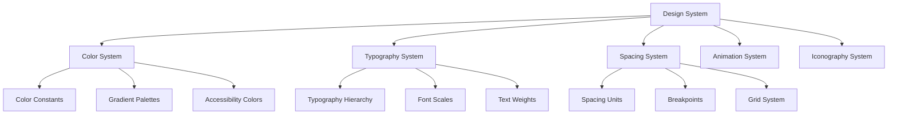

# Design Document

## Overview

The modern UI redesign transforms the DogDog trivia game into a contemporary, child-friendly application that follows current mobile design trends while maintaining educational value and accessibility. The design emphasizes clean layouts, vibrant colors, smooth animations, and effective use of the existing dog breed imagery to create an engaging and polished user experience.

## Architecture

### Design System Architecture



### Component Hierarchy

The redesign follows a component-based architecture where each UI element is built from reusable, themed components:

- **Foundation Layer**: Colors, typography, spacing, shadows
- **Component Layer**: Buttons, cards, inputs, progress indicators
- **Pattern Layer**: Screen layouts, navigation patterns, animation sequences
- **Screen Layer**: Complete screen implementations using patterns and components

## Components and Interfaces

### Core Design Components

#### 1. Modern Card System
```dart
class ModernCard extends StatelessWidget {
  final Widget child;
  final EdgeInsets padding;
  final Color? backgroundColor;
  final double elevation;
  final BorderRadius borderRadius;
  final List<BoxShadow>? customShadows;
  
  // Implementation provides consistent card styling
  // with rounded corners, subtle shadows, and proper spacing
}
```

#### 2. Gradient Button System
```dart
class GradientButton extends StatelessWidget {
  final VoidCallback onPressed;
  final Widget child;
  final List<Color> gradientColors;
  final double borderRadius;
  final EdgeInsets padding;
  final bool isEnabled;
  
  // Implementation provides modern gradient buttons
  // with press animations and accessibility support
}
```

#### 3. Success Animation Widget
```dart
class SuccessAnimationWidget extends StatefulWidget {
  final bool isVisible;
  final VoidCallback? onAnimationComplete;
  final Duration animationDuration;
  
  // Implementation alternates between success1.png and success2.png
  // to create animated happy dog feedback
}
```

#### 4. Dog Breed Card
```dart
class DogBreedCard extends StatelessWidget {
  final String dogImagePath;
  final String title;
  final String description;
  final Color accentColor;
  final VoidCallback onTap;
  final bool isEnabled;
  
  // Implementation creates modern cards featuring dog breed images
  // with consistent styling and interactive feedback
}
```

### Screen Redesign Specifications

#### Home Screen Redesign
- **Background**: Soft gradient from light purple (#F3F0FF) to white
- **Decorative Elements**: Floating stars and circles with subtle animations
- **Main Container**: Centered white card with 16px border radius and subtle shadow
- **Logo Area**: Large dog character illustration (can use one of the breed images as placeholder)
- **Typography**: Modern font hierarchy with proper spacing
- **Button**: Large gradient button (purple to blue) with rounded corners

#### Difficulty Selection Screen Redesign
- **Layout**: Vertical scrollable list of large cards
- **Card Design**: Each card features:
  - Dog breed image (120x120px) with rounded corners
  - Difficulty name in large, bold typography
  - Description text in secondary color
  - Colored play button with gradient
  - Distinct accent colors per difficulty
- **Spacing**: 16px between cards, 20px padding around content
- **Colors**: 
  - Easy (Chihuahua): Green gradient (#10B981 to #059669)
  - Medium (Cocker): Yellow gradient (#F59E0B to #D97706)
  - Hard (German Shepherd): Red gradient (#EF4444 to #DC2626)
  - Expert (Great Dane): Purple gradient (#8B5CF6 to #7C3AED)

#### Game Screen Redesign
- **Question Card**: Clean white card with rounded corners containing question text
- **Answer Buttons**: Modern rounded buttons with hover/press states
- **Progress Elements**: Modern circular progress indicators for timer
- **Power-up Bar**: Horizontal row of modern icon buttons with badges
- **Score Display**: Clean typography with subtle background card

#### Success Animation Implementation
- **Animation Sequence**: 
  1. Scale up success1.png from 0.8 to 1.2 over 300ms
  2. Hold for 200ms
  3. Switch to success2.png with same scale
  4. Hold for 200ms
  5. Repeat cycle 2-3 times
  6. Scale down and fade out over 400ms
- **Positioning**: Center of screen with overlay background
- **Size**: Responsive sizing based on screen dimensions

## Data Models

### Design Token Models

#### Color System
```dart
class ModernColors {
  // Primary Colors
  static const Color primaryPurple = Color(0xFF8B5CF6);
  static const Color primaryBlue = Color(0xFF4A90E2);
  
  // Gradient Colors
  static const List<Color> purpleGradient = [Color(0xFF8B5CF6), Color(0xFF7C3AED)];
  static const List<Color> blueGradient = [Color(0xFF4A90E2), Color(0xFF3B82F6)];
  static const List<Color> greenGradient = [Color(0xFF10B981), Color(0xFF059669)];
  static const List<Color> yellowGradient = [Color(0xFFF59E0B), Color(0xFFD97706)];
  static const List<Color> redGradient = [Color(0xFFEF4444), Color(0xFFDC2626)];
  
  // Background Colors
  static const Color backgroundGradientStart = Color(0xFFF3F0FF);
  static const Color backgroundGradientEnd = Color(0xFFFFFFFF);
  static const Color cardBackground = Color(0xFFFFFFFF);
  
  // Text Colors
  static const Color textPrimary = Color(0xFF1F2937);
  static const Color textSecondary = Color(0xFF6B7280);
  static const Color textLight = Color(0xFF9CA3AF);
}
```

#### Typography System
```dart
class ModernTypography {
  static const TextStyle headingLarge = TextStyle(
    fontSize: 28,
    fontWeight: FontWeight.bold,
    height: 1.2,
    letterSpacing: -0.5,
  );
  
  static const TextStyle headingMedium = TextStyle(
    fontSize: 24,
    fontWeight: FontWeight.w600,
    height: 1.3,
  );
  
  static const TextStyle bodyLarge = TextStyle(
    fontSize: 18,
    fontWeight: FontWeight.normal,
    height: 1.4,
  );
  
  static const TextStyle bodyMedium = TextStyle(
    fontSize: 16,
    fontWeight: FontWeight.normal,
    height: 1.5,
  );
  
  static const TextStyle buttonText = TextStyle(
    fontSize: 16,
    fontWeight: FontWeight.w600,
    height: 1.2,
  );
}
```

#### Spacing System
```dart
class ModernSpacing {
  static const double xs = 4.0;
  static const double sm = 8.0;
  static const double md = 16.0;
  static const double lg = 24.0;
  static const double xl = 32.0;
  static const double xxl = 48.0;
  
  static const EdgeInsets cardPadding = EdgeInsets.all(20.0);
  static const EdgeInsets buttonPadding = EdgeInsets.symmetric(
    horizontal: 24.0,
    vertical: 16.0,
  );
  static const EdgeInsets screenPadding = EdgeInsets.all(20.0);
}
```

### Animation Models

#### Success Animation Configuration
```dart
class SuccessAnimationConfig {
  static const Duration frameDuration = Duration(milliseconds: 200);
  static const Duration scaleDuration = Duration(milliseconds: 300);
  static const Duration fadeOutDuration = Duration(milliseconds: 400);
  static const int repeatCount = 3;
  static const double scaleMin = 0.8;
  static const double scaleMax = 1.2;
  
  static const List<String> animationFrames = [
    'assets/images/success1.png',
    'assets/images/success2.png',
  ];
}
```

## User Interface Design

### Visual Design Principles

#### 1. Modern Card-Based Layout
- All content organized in clean, rounded cards
- Consistent 16px border radius across all cards
- Subtle shadows for depth (elevation 2-4)
- Proper spacing between elements (16-24px)

#### 2. Vibrant Color System
- Gradient backgrounds for interactive elements
- High contrast for accessibility compliance
- Consistent color coding for different difficulty levels
- Soft, child-friendly color palette

#### 3. Typography Hierarchy
- Clear visual hierarchy with appropriate font sizes
- Consistent line heights and letter spacing
- Proper contrast ratios for readability
- Responsive text scaling

#### 4. Interactive Feedback
- Immediate visual feedback for all interactions
- Smooth animations with appropriate easing curves
- Hover and press states for all interactive elements
- Success animations using provided dog images

### Screen Layout Specifications

#### Home Screen Layout
```
┌─────────────────────────────────────┐
│  Gradient Background with Decorations │
│  ┌─────────────────────────────────┐ │
│  │        White Card Container      │ │
│  │  ┌─────────────────────────────┐ │ │
│  │  │      Dog Character Logo     │ │ │
│  │  └─────────────────────────────┘ │ │
│  │                                 │ │
│  │      "Let's start!" Title       │ │
│  │    Subtitle Description Text    │ │
│  │                                 │ │
│  │  ┌─────────────────────────────┐ │ │
│  │  │    Large Gradient Button    │ │ │
│  │  │        "Start Game"         │ │ │
│  │  └─────────────────────────────┘ │ │
│  │                                 │ │
│  │    Secondary Action Buttons     │ │
│  └─────────────────────────────────┘ │
└─────────────────────────────────────┘
```

#### Difficulty Selection Layout
```
┌─────────────────────────────────────┐
│           Header with Title          │
│                                     │
│  ┌─────────────────────────────────┐ │
│  │  🐕 Chihuahua Image    EASY     │ │
│  │  Description text here          │ │
│  │  [Green Play Button]            │ │
│  └─────────────────────────────────┘ │
│                                     │
│  ┌─────────────────────────────────┐ │
│  │  🐕 Cocker Image      MEDIUM    │ │
│  │  Description text here          │ │
│  │  [Yellow Play Button]           │ │
│  └─────────────────────────────────┘ │
│                                     │
│  ┌─────────────────────────────────┐ │
│  │  🐕 Shepherd Image     HARD     │ │
│  │  Description text here          │ │
│  │  [Red Play Button]              │ │
│  └─────────────────────────────────┘ │
│                                     │
│  ┌─────────────────────────────────┐ │
│  │  🐕 Great Dane Image  EXPERT    │ │
│  │  Description text here          │ │
│  │  [Purple Play Button]           │ │
│  └─────────────────────────────────┘ │
└─────────────────────────────────────┘
```

## Error Handling

### Design Error Recovery

#### 1. Image Loading Failures
- **Fallback Strategy**: Use colored placeholder circles with breed initials
- **Progressive Loading**: Show skeleton screens while images load
- **Retry Mechanism**: Automatic retry with exponential backoff
- **User Feedback**: Subtle loading indicators without blocking UI

#### 2. Animation Performance Issues
- **Reduced Motion**: Respect accessibility preferences for reduced motion
- **Performance Monitoring**: Monitor frame rates and adjust animation complexity
- **Graceful Degradation**: Fall back to simpler animations on lower-end devices
- **Memory Management**: Proper disposal of animation controllers

#### 3. Layout Responsiveness
- **Flexible Layouts**: Use responsive design principles for various screen sizes
- **Safe Areas**: Proper handling of device safe areas and notches
- **Orientation Changes**: Smooth transitions between portrait and landscape
- **Text Scaling**: Support for system text scaling preferences

## Testing Strategy

### Visual Testing
- **Screenshot Testing**: Automated screenshot comparison for UI consistency
- **Cross-Platform Testing**: Ensure consistent appearance across iOS and Android
- **Device Testing**: Test on various screen sizes and resolutions
- **Accessibility Testing**: Verify color contrast and screen reader compatibility

### Animation Testing
- **Performance Testing**: Ensure 60 FPS animation performance
- **Timing Testing**: Verify animation durations and sequences
- **Interruption Testing**: Test animation behavior when interrupted
- **Memory Testing**: Monitor memory usage during animations

### User Experience Testing
- **Usability Testing**: Test with target age group (8-12 years)
- **Accessibility Testing**: Test with screen readers and accessibility tools
- **Performance Testing**: Measure app startup time and responsiveness
- **Cross-Platform Testing**: Ensure consistent experience across platforms

## Implementation Considerations

### Asset Management
- **Image Optimization**: Compress dog breed images for optimal performance
- **Multiple Resolutions**: Provide 1x, 2x, and 3x versions for different screen densities
- **Lazy Loading**: Load images on demand to improve startup performance
- **Caching Strategy**: Implement efficient image caching

### Performance Optimization
- **Widget Optimization**: Use const constructors and efficient widget rebuilding
- **Animation Optimization**: Use efficient animation techniques and proper disposal
- **Memory Management**: Proper cleanup of resources and controllers
- **Build Optimization**: Minimize widget tree depth and unnecessary rebuilds

### Accessibility Enhancements
- **Semantic Labels**: Provide clear semantic labels for all interactive elements
- **Focus Management**: Proper focus order and keyboard navigation
- **Color Independence**: Ensure information is not conveyed by color alone
- **Text Scaling**: Support for dynamic text scaling preferences

### Localization Support
- **Text Extraction**: Extract all UI text to localization files
- **Image Localization**: Support for localized images if needed
- **RTL Support**: Prepare layouts for right-to-left languages
- **Cultural Adaptation**: Consider cultural preferences in design choices