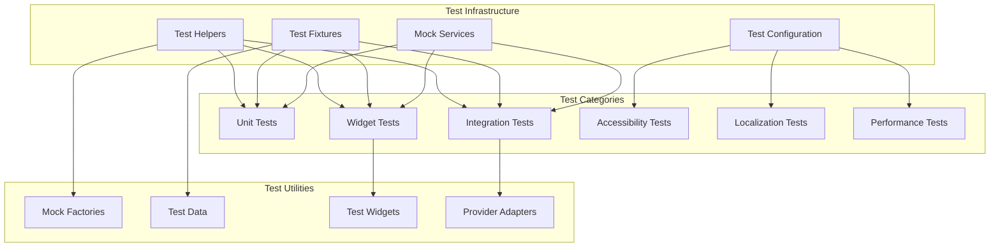

# Design Document

## Overview

The test fixing design addresses systematic failures across the DogDog trivia game's test suite through a structured approach that identifies root causes, establishes robust test infrastructure, and implements consistent testing patterns. The design focuses on creating maintainable test utilities, fixing dependency injection issues, resolving mock setup problems, and ensuring comprehensive coverage across all test categories including unit, integration, widget, accessibility, localization, and performance tests.

## Architecture

### Test Infrastructure Architecture



### Test Failure Analysis

Based on common Flutter testing issues and the project structure, the main failure categories are:

1. **Provider/State Management Issues**: Tests failing due to missing Provider context or incorrect state setup
2. **Mock Setup Problems**: Inconsistent or incomplete mocking of services and dependencies
3. **Async Operation Handling**: Improper handling of futures, streams, and timers in tests
4. **Widget Testing Issues**: Missing required dependencies, incorrect widget wrapping, or animation handling
5. **Test Data Inconsistencies**: Hardcoded values that don't match actual implementation
6. **Resource Management**: Tests not properly cleaning up resources or resetting state

## Components and Interfaces

### Test Helper System

#### TestHelper Class
```dart
class TestHelper {
  static Widget createTestApp({
    required Widget child,
    List<ChangeNotifierProvider>? providers,
    Locale? locale,
    ThemeData? theme,
  }) {
    return MultiProvider(
      providers: providers ?? _getDefaultProviders(),
      child: MaterialApp(
        locale: locale ?? const Locale('en'),
        localizationsDelegates: const [
          AppLocalizations.delegate,
          GlobalMaterialLocalizations.delegate,
          GlobalWidgetsLocalizations.delegate,
          GlobalCupertinoLocalizations.delegate,
        ],
        supportedLocales: const [
          Locale('en'),
          Locale('de'),
          Locale('es'),
        ],
        theme: theme ?? ThemeData.light(),
        home: child,
      ),
    );
  }
  
  static List<ChangeNotifierProvider> _getDefaultProviders() {
    return [
      ChangeNotifierProvider<GameController>(
        create: (_) => MockGameController(),
      ),
      ChangeNotifierProvider<PowerUpController>(
        create: (_) => MockPowerUpController(),
      ),
      // Add other required providers
    ];
  }
  
  static Future<void> pumpAndSettle(WidgetTester tester, {
    Duration timeout = const Duration(seconds: 10),
  }) async {
    await tester.pumpAndSettle(timeout);
  }
  
  static Future<void> pumpWidget(
    WidgetTester tester,
    Widget widget, {
    Duration? duration,
  }) async {
    await tester.pumpWidget(widget);
    if (duration != null) {
      await tester.pump(duration);
    }
  }
}
```

#### MockFactory System
```dart
class MockFactory {
  static GameController createMockGameController({
    GameState? initialState,
    List<Question>? questions,
    PlayerProgress? progress,
  }) {
    final controller = MockGameController();
    
    // Set up default behavior
    when(controller.gameState).thenReturn(
      initialState ?? GameState.initial(),
    );
    when(controller.questions).thenReturn(
      questions ?? TestData.sampleQuestions,
    );
    when(controller.playerProgress).thenReturn(
      progress ?? TestData.sampleProgress,
    );
    
    // Set up method behaviors
    when(controller.startGame(any)).thenAnswer((_) async {});
    when(controller.answerQuestion(any)).thenAnswer((_) async {});
    when(controller.nextQuestion()).thenAnswer((_) async {});
    
    return controller;
  }
  
  static PowerUpController createMockPowerUpController({
    Map<PowerUpType, int>? initialPowerUps,
  }) {
    final controller = MockPowerUpController();
    
    when(controller.availablePowerUps).thenReturn(
      initialPowerUps ?? TestData.defaultPowerUps,
    );
    
    // Set up power-up usage methods
    for (final powerUpType in PowerUpType.values) {
      when(controller.canUsePowerUp(powerUpType)).thenReturn(true);
      when(controller.usePowerUp(powerUpType)).thenAnswer((_) async => true);
    }
    
    return controller;
  }
  
  static QuestionService createMockQuestionService({
    List<Question>? questions,
  }) {
    final service = MockQuestionService();
    
    when(service.loadQuestions()).thenAnswer(
      (_) async => questions ?? TestData.sampleQuestions,
    );
    when(service.getQuestionsForDifficulty(any)).thenReturn(
      questions ?? TestData.sampleQuestions,
    );
    
    return service;
  }
  
  static AudioService createMockAudioService() {
    final service = MockAudioService();
    
    when(service.playSound(any)).thenAnswer((_) async {});
    when(service.playCorrectAnswerSound()).thenAnswer((_) async {});
    when(service.playIncorrectAnswerSound()).thenAnswer((_) async {});
    when(service.playPowerUpSound()).thenAnswer((_) async {});
    
    return service;
  }
}
```

#### TestData Class
```dart
class TestData {
  static const List<Question> sampleQuestions = [
    Question(
      id: 'test_1',
      text: 'What is the smallest dog breed?',
      options: ['Chihuahua', 'Pomeranian', 'Yorkshire Terrier', 'Maltese'],
      correctAnswerIndex: 0,
      difficulty: Difficulty.easy,
      category: 'Dog Breeds',
      funFact: 'Chihuahuas are the world\'s smallest dog breed.',
    ),
    Question(
      id: 'test_2',
      text: 'How many teeth do adult dogs have?',
      options: ['32', '42', '48', '52'],
      correctAnswerIndex: 1,
      difficulty: Difficulty.medium,
      category: 'Dog Anatomy',
      funFact: 'Adult dogs have 42 teeth.',
    ),
    // Add more test questions
  ];
  
  static final PlayerProgress sampleProgress = PlayerProgress(
    totalQuestionsAnswered: 50,
    correctAnswers: 35,
    currentStreak: 5,
    bestStreak: 12,
    totalScore: 1750,
    currentRank: Rank.cockerSpaniel,
    achievements: [
      Achievement.firstCorrectAnswer,
      Achievement.tenQuestionsAnswered,
    ],
    powerUpsEarned: {
      PowerUpType.fiftyFifty: 3,
      PowerUpType.hint: 2,
      PowerUpType.extraTime: 1,
      PowerUpType.skip: 1,
      PowerUpType.secondChance: 0,
    },
  );
  
  static const Map<PowerUpType, int> defaultPowerUps = {
    PowerUpType.fiftyFifty: 2,
    PowerUpType.hint: 2,
    PowerUpType.extraTime: 1,
    PowerUpType.skip: 1,
    PowerUpType.secondChance: 1,
  };
  
  static GameState get sampleGameState => GameState(
    currentQuestionIndex: 0,
    questions: sampleQuestions,
    score: 0,
    lives: 3,
    streak: 0,
    timeRemaining: 30,
    isGameActive: true,
    difficulty: Difficulty.easy,
  );
}
```

### Widget Test Infrastructure

#### WidgetTestHelper Class
```dart
class WidgetTestHelper {
  static Future<void> testWidget(
    WidgetTester tester,
    Widget widget, {
    List<ChangeNotifierProvider>? providers,
    Locale? locale,
    VoidCallback? setup,
    VoidCallback? tearDown,
  }) async {
    setup?.call();
    
    await tester.pumpWidget(
      TestHelper.createTestApp(
        child: widget,
        providers: providers,
        locale: locale,
      ),
    );
    
    await TestHelper.pumpAndSettle(tester);
    
    tearDown?.call();
  }
  
  static Future<void> testScreen(
    WidgetTester tester,
    Widget screen, {
    Map<String, dynamic>? routeArguments,
  }) async {
    await tester.pumpWidget(
      TestHelper.createTestApp(
        child: Navigator(
          onGenerateRoute: (settings) {
            return MaterialPageRoute(
              builder: (_) => screen,
              settings: RouteSettings(arguments: routeArguments),
            );
          },
        ),
      ),
    );
    
    await TestHelper.pumpAndSettle(tester);
  }
  
  static Future<void> tapAndSettle(
    WidgetTester tester,
    Finder finder,
  ) async {
    await tester.tap(finder);
    await TestHelper.pumpAndSettle(tester);
  }
  
  static Future<void> enterTextAndSettle(
    WidgetTester tester,
    Finder finder,
    String text,
  ) async {
    await tester.enterText(finder, text);
    await TestHelper.pumpAndSettle(tester);
  }
}
```

### Mock Service Implementations

#### MockGameController
```dart
class MockGameController extends Mock implements GameController {
  @override
  GameState get gameState => super.noSuchMethod(
    Invocation.getter(#gameState),
    returnValue: TestData.sampleGameState,
  );
  
  @override
  List<Question> get questions => super.noSuchMethod(
    Invocation.getter(#questions),
    returnValue: TestData.sampleQuestions,
  );
  
  @override
  PlayerProgress get playerProgress => super.noSuchMethod(
    Invocation.getter(#playerProgress),
    returnValue: TestData.sampleProgress,
  );
  
  @override
  Future<void> startGame(Difficulty difficulty) => super.noSuchMethod(
    Invocation.method(#startGame, [difficulty]),
    returnValue: Future<void>.value(),
  );
  
  @override
  Future<void> answerQuestion(int answerIndex) => super.noSuchMethod(
    Invocation.method(#answerQuestion, [answerIndex]),
    returnValue: Future<void>.value(),
  );
  
  @override
  Future<void> nextQuestion() => super.noSuchMethod(
    Invocation.method(#nextQuestion, []),
    returnValue: Future<void>.value(),
  );
}
```

#### MockPowerUpController
```dart
class MockPowerUpController extends Mock implements PowerUpController {
  @override
  Map<PowerUpType, int> get availablePowerUps => super.noSuchMethod(
    Invocation.getter(#availablePowerUps),
    returnValue: TestData.defaultPowerUps,
  );
  
  @override
  bool canUsePowerUp(PowerUpType type) => super.noSuchMethod(
    Invocation.method(#canUsePowerUp, [type]),
    returnValue: true,
  );
  
  @override
  Future<bool> usePowerUp(PowerUpType type) => super.noSuchMethod(
    Invocation.method(#usePowerUp, [type]),
    returnValue: Future.value(true),
  );
  
  @override
  void addPowerUp(PowerUpType type, int count) => super.noSuchMethod(
    Invocation.method(#addPowerUp, [type, count]),
    returnValue: null,
  );
}
```

### Test Configuration System

#### TestConfig Class
```dart
class TestConfig {
  static const Duration defaultTimeout = Duration(seconds: 30);
  static const Duration animationTimeout = Duration(seconds: 5);
  static const Duration networkTimeout = Duration(seconds: 10);
  
  static void setUpAll() {
    // Global test setup
    TestWidgetsFlutterBinding.ensureInitialized();
    
    // Set up mock services
    _setupMockServices();
    
    // Configure test environment
    _configureTestEnvironment();
  }
  
  static void tearDownAll() {
    // Global test cleanup
    _cleanupMockServices();
    _resetTestEnvironment();
  }
  
  static void setUp() {
    // Per-test setup
    _resetMockStates();
  }
  
  static void tearDown() {
    // Per-test cleanup
    _cleanupTestResources();
  }
  
  static void _setupMockServices() {
    // Register mock services with service locator if used
  }
  
  static void _configureTestEnvironment() {
    // Set up test-specific configurations
  }
  
  static void _cleanupMockServices() {
    // Clean up mock services
  }
  
  static void _resetTestEnvironment() {
    // Reset test environment
  }
  
  static void _resetMockStates() {
    // Reset mock states between tests
  }
  
  static void _cleanupTestResources() {
    // Clean up test resources
  }
}
```

### Accessibility Test Infrastructure

#### AccessibilityTestHelper
```dart
class AccessibilityTestHelper {
  static Future<void> testAccessibility(
    WidgetTester tester,
    Widget widget,
  ) async {
    await WidgetTestHelper.testWidget(tester, widget);
    
    // Test semantic labels
    await _testSemanticLabels(tester);
    
    // Test screen reader support
    await _testScreenReaderSupport(tester);
    
    // Test keyboard navigation
    await _testKeyboardNavigation(tester);
    
    // Test contrast ratios
    await _testContrastRatios(tester);
    
    // Test touch target sizes
    await _testTouchTargetSizes(tester);
  }
  
  static Future<void> _testSemanticLabels(WidgetTester tester) async {
    // Verify all interactive elements have semantic labels
    final semantics = tester.binding.pipelineOwner.semanticsOwner;
    expect(semantics, isNotNull);
    
    // Check for missing labels
    final finder = find.byType(GestureDetector);
    for (int i = 0; i < finder.evaluate().length; i++) {
      final element = finder.evaluate().elementAt(i);
      final semanticsData = element.renderObject?.debugSemantics;
      expect(semanticsData?.label, isNotNull);
    }
  }
  
  static Future<void> _testScreenReaderSupport(WidgetTester tester) async {
    // Test screen reader announcements
    final SemanticsHandle handle = tester.binding.pipelineOwner.ensureSemantics();
    
    // Verify semantic tree structure
    expect(handle, isNotNull);
    
    handle.dispose();
  }
  
  static Future<void> _testKeyboardNavigation(WidgetTester tester) async {
    // Test tab navigation
    await tester.sendKeyEvent(LogicalKeyboardKey.tab);
    await TestHelper.pumpAndSettle(tester);
    
    // Verify focus management
    final focusedWidget = FocusManager.instance.primaryFocus;
    expect(focusedWidget, isNotNull);
  }
  
  static Future<void> _testContrastRatios(WidgetTester tester) async {
    // Test color contrast ratios meet WCAG guidelines
    // This would require custom implementation to analyze rendered colors
  }
  
  static Future<void> _testTouchTargetSizes(WidgetTester tester) async {
    // Verify touch targets are at least 44x44 pixels
    final buttons = find.byType(ElevatedButton);
    for (int i = 0; i < buttons.evaluate().length; i++) {
      final button = tester.widget<ElevatedButton>(buttons.at(i));
      final renderBox = tester.renderObject<RenderBox>(buttons.at(i));
      final size = renderBox.size;
      
      expect(size.width, greaterThanOrEqualTo(44.0));
      expect(size.height, greaterThanOrEqualTo(44.0));
    }
  }
}
```

### Localization Test Infrastructure

#### LocalizationTestHelper
```dart
class LocalizationTestHelper {
  static const List<Locale> supportedLocales = [
    Locale('en'),
    Locale('de'),
    Locale('es'),
  ];
  
  static Future<void> testAllLocales(
    WidgetTester tester,
    Widget widget,
    void Function(AppLocalizations l10n) testFunction,
  ) async {
    for (final locale in supportedLocales) {
      await _testLocale(tester, widget, locale, testFunction);
    }
  }
  
  static Future<void> _testLocale(
    WidgetTester tester,
    Widget widget,
    Locale locale,
    void Function(AppLocalizations l10n) testFunction,
  ) async {
    await WidgetTestHelper.testWidget(
      tester,
      widget,
      locale: locale,
    );
    
    final l10n = AppLocalizations.of(tester.element(find.byWidget(widget)));
    expect(l10n, isNotNull);
    expect(l10n!.localeName, equals(locale.languageCode));
    
    testFunction(l10n);
  }
  
  static void verifyTranslations(AppLocalizations l10n) {
    // Verify all required translations exist
    expect(l10n.appTitle, isNotEmpty);
    expect(l10n.startGame, isNotEmpty);
    expect(l10n.gameOver, isNotEmpty);
    expect(l10n.score, isNotEmpty);
    expect(l10n.lives, isNotEmpty);
    
    // Verify no placeholder text
    expect(l10n.appTitle, isNot(contains('TODO')));
    expect(l10n.startGame, isNot(contains('TODO')));
  }
  
  static Future<void> testLanguageSwitching(
    WidgetTester tester,
    Widget widget,
  ) async {
    // Test switching between languages
    for (int i = 0; i < supportedLocales.length; i++) {
      await WidgetTestHelper.testWidget(
        tester,
        widget,
        locale: supportedLocales[i],
      );
      
      // Verify UI updates correctly
      final l10n = AppLocalizations.of(tester.element(find.byWidget(widget)));
      expect(l10n!.localeName, equals(supportedLocales[i].languageCode));
    }
  }
}
```

### Performance Test Infrastructure

#### PerformanceTestHelper
```dart
class PerformanceTestHelper {
  static Future<void> testAnimationPerformance(
    WidgetTester tester,
    Widget widget,
    VoidCallback triggerAnimation,
  ) async {
    await WidgetTestHelper.testWidget(tester, widget);
    
    // Start performance monitoring
    final timeline = Timeline();
    timeline.startSync('animation_test');
    
    // Trigger animation
    triggerAnimation();
    
    // Pump frames and measure performance
    const frameDuration = Duration(milliseconds: 16); // 60 FPS
    for (int i = 0; i < 60; i++) { // Test 1 second of animation
      await tester.pump(frameDuration);
    }
    
    timeline.finishSync();
    
    // Verify no dropped frames (this would require custom frame monitoring)
    // In a real implementation, you'd analyze the timeline data
  }
  
  static Future<void> testMemoryUsage(
    WidgetTester tester,
    Widget widget,
    VoidCallback operation,
  ) async {
    await WidgetTestHelper.testWidget(tester, widget);
    
    // Measure memory before operation
    final memoryBefore = _getCurrentMemoryUsage();
    
    // Perform operation
    operation();
    await TestHelper.pumpAndSettle(tester);
    
    // Force garbage collection
    _forceGarbageCollection();
    
    // Measure memory after operation
    final memoryAfter = _getCurrentMemoryUsage();
    
    // Verify no significant memory leaks
    final memoryIncrease = memoryAfter - memoryBefore;
    expect(memoryIncrease, lessThan(10 * 1024 * 1024)); // Less than 10MB increase
  }
  
  static int _getCurrentMemoryUsage() {
    // This would require platform-specific implementation
    // For testing purposes, return a mock value
    return 0;
  }
  
  static void _forceGarbageCollection() {
    // Force garbage collection if possible
    // This is platform-specific and may not be available in all environments
  }
  
  static Future<void> testImageLoadingPerformance(
    WidgetTester tester,
    Widget widget,
  ) async {
    await WidgetTestHelper.testWidget(tester, widget);
    
    final stopwatch = Stopwatch()..start();
    
    // Wait for all images to load
    await tester.runAsync(() async {
      for (final element in find.byType(Image).evaluate()) {
        final Image image = element.widget as Image;
        final ImageProvider provider = image.image;
        final ImageStream stream = provider.resolve(ImageConfiguration.empty);
        final Completer<void> completer = Completer<void>();
        
        stream.addListener(ImageStreamListener((info, synchronousCall) {
          if (!completer.isCompleted) {
            completer.complete();
          }
        }));
        
        await completer.future;
      }
    });
    
    stopwatch.stop();
    
    // Verify images load within reasonable time
    expect(stopwatch.elapsedMilliseconds, lessThan(5000)); // Less than 5 seconds
  }
}
```

## Error Handling

### Test Error Recovery
```dart
class TestErrorHandler {
  static void handleTestFailure(
    String testName,
    dynamic error,
    StackTrace stackTrace,
  ) {
    // Log detailed error information
    print('Test failed: $testName');
    print('Error: $error');
    print('Stack trace: $stackTrace');
    
    // Attempt to provide helpful debugging information
    _analyzeError(error);
    
    // Clean up any resources that might be causing issues
    _cleanupAfterFailure();
  }
  
  static void _analyzeError(dynamic error) {
    if (error.toString().contains('Provider')) {
      print('Hint: This appears to be a Provider-related error. Check that all required providers are set up in the test.');
    } else if (error.toString().contains('MediaQuery')) {
      print('Hint: This appears to be a MediaQuery error. Ensure the widget is wrapped in a MaterialApp or MediaQuery.');
    } else if (error.toString().contains('Localizations')) {
      print('Hint: This appears to be a localization error. Ensure localization delegates are properly configured.');
    }
  }
  
  static void _cleanupAfterFailure() {
    // Reset any global state that might affect subsequent tests
    // Clear any cached data
    // Reset mock states
  }
}
```

### Async Test Handling
```dart
class AsyncTestHelper {
  static Future<T> waitForCondition<T>(
    Future<T> Function() condition, {
    Duration timeout = const Duration(seconds: 10),
    Duration pollInterval = const Duration(milliseconds: 100),
  }) async {
    final stopwatch = Stopwatch()..start();
    
    while (stopwatch.elapsed < timeout) {
      try {
        final result = await condition();
        return result;
      } catch (e) {
        await Future.delayed(pollInterval);
      }
    }
    
    throw TimeoutException('Condition not met within timeout', timeout);
  }
  
  static Future<void> waitForWidget(
    WidgetTester tester,
    Finder finder, {
    Duration timeout = const Duration(seconds: 5),
  }) async {
    await waitForCondition(
      () async {
        await tester.pump();
        if (finder.evaluate().isNotEmpty) {
          return true;
        }
        throw Exception('Widget not found');
      },
      timeout: timeout,
    );
  }
  
  static Future<void> waitForAsyncOperation(
    WidgetTester tester, {
    Duration timeout = const Duration(seconds: 10),
  }) async {
    await tester.runAsync(() async {
      // Wait for any pending async operations
      await Future.delayed(Duration.zero);
    });
    
    await TestHelper.pumpAndSettle(tester, timeout: timeout);
  }
}
```

## Testing Strategy

### Test Organization Strategy

1. **Test File Structure**: Maintain consistent naming and organization
   - Unit tests: `test/{category}/{file}_test.dart`
   - Integration tests: `test/integration/{feature}_integration_test.dart`
   - Widget tests: `test/widgets/{widget}_test.dart`
   - Screen tests: `test/screens/{screen}_test.dart`

2. **Test Grouping**: Use descriptive group names and nested structure
   ```dart
   group('GameController', () {
     group('initialization', () {
       test('should initialize with default state', () {});
       test('should load questions on initialization', () {});
     });
     
     group('game flow', () {
       test('should start game with selected difficulty', () {});
       test('should handle correct answers', () {});
       test('should handle incorrect answers', () {});
     });
   });
   ```

3. **Test Data Management**: Use consistent test data across all tests
   - Centralized test data in `TestData` class
   - Reusable mock factories
   - Consistent fixture setup

### Coverage Strategy

1. **Unit Test Coverage**: Aim for 90%+ coverage on business logic
   - All controller methods
   - All service methods
   - All model methods and properties
   - All utility functions

2. **Integration Test Coverage**: Cover critical user flows
   - Complete game flow from start to finish
   - Power-up usage scenarios
   - Error handling and recovery
   - State persistence and loading

3. **Widget Test Coverage**: Test all custom widgets and screens
   - Rendering with various states
   - User interactions
   - Error states
   - Loading states

### Performance Testing Strategy

1. **Animation Performance**: Verify smooth animations
2. **Memory Usage**: Check for memory leaks
3. **Image Loading**: Verify efficient image handling
4. **Responsive Design**: Test across different screen sizes

## Implementation Considerations

### Test Execution Order
- Run unit tests first (fastest feedback)
- Run widget tests second
- Run integration tests last (most comprehensive)

### Parallel Test Execution
- Ensure tests don't share mutable state
- Use proper test isolation
- Handle async operations correctly

### CI/CD Integration
- Generate test reports in standard formats
- Provide clear failure messages
- Support test result caching
- Handle platform-specific test requirements

### Maintenance Strategy
- Regular test review and cleanup
- Update tests when implementation changes
- Monitor test execution times
- Identify and fix flaky tests