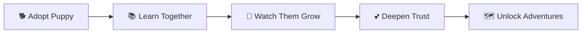
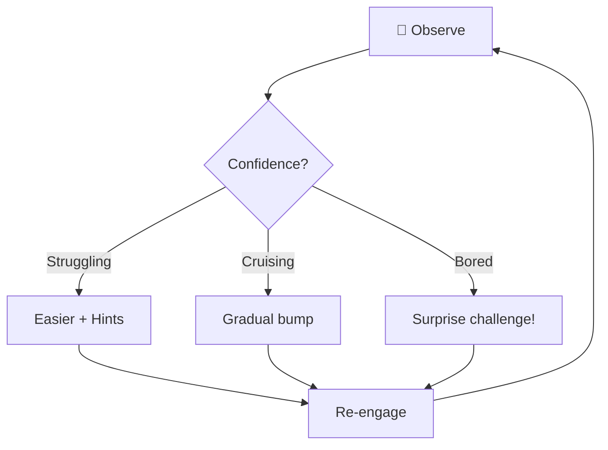
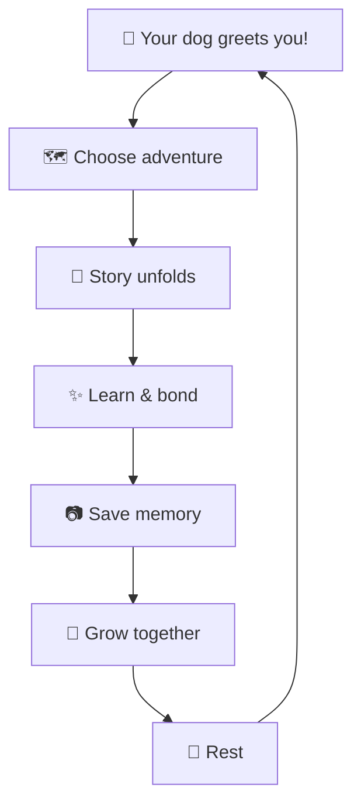

# 🐕 Dogdog 2026 — Game Design Document

> **A companion journey where children bond with their virtual dog while
> learning about our four-legged friends.**

---

## 🎯 Design Philosophy

| Principle                    | Implementation                        |
| ---------------------------- | ------------------------------------- |
| **Nurturing over punishing** | No "game over" — learning focus       |
| **Emotional connection**     | Virtual companion that grows with you |
| **Story-driven learning**    | Questions woven into adventures       |
| **Joyful discovery**         | Explorable world map                  |
| **Gentle progression**       | Adaptive difficulty, no pressure      |

---

## 🐾 Your Companion Dog

The heart of Dogdog is your **virtual companion** — a dog you adopt, name, and
grow alongside.

### Bond System



### Growth Stages

| Stage         | Unlocks            | Breeds Available                       |
| ------------- | ------------------ | -------------------------------------- |
| 🐶 Puppy      | Home + Bark Park   | Labrador, Golden Retriever, Beagle     |
| 🐕 Adolescent | Vet Clinic, Trails | Poodle, Bulldog, Boxer, Corgi          |
| 🦮 Adult      | Dog Show, Beach    | German Shepherd, Husky, Dalmatian      |
| 👑 Elder      | Mystery Island     | Rare breeds: Shiba Inu, Akita, Basenji |

### Mood States

| Mood       | Trigger                 | Animation                  |
| ---------- | ----------------------- | -------------------------- |
| 😊 Happy   | Correct answers, treats | Tail wagging, playful bark |
| 🧐 Curious | New adventure           | Head tilt, sniffing        |
| 😴 Sleepy  | Long session            | Yawning, stretching        |
| 🎉 Excited | Streak, discovery       | Zoomies, jumping           |

---

## 📖 Narrative Micro-Arcs

Each session tells a **mini-story** with questions woven naturally into the
adventure.

### Session Structure

```
🌅 Greeting     →  "Max wants to explore the beach today!"
📚 Adventure    →  5-7 questions as discoveries
🎉 Climax       →  Find something amazing together
📷 Memory       →  Saved to your Journal
🌙 Rest         →  Cuddle time (optional)
```

### Example Story Arc

> _"Max found a mysterious paw print at the beach!"_
>
> **Questions:**
>
> - Which breed loves swimming? → Golden Retriever
> - How big is a Newfoundland's paw? → Very large!
> - What makes dogs good swimmers? → Webbed feet
>
> _"It was a Newfoundland named Captain! Max made a new friend!"_

---

## 🗺️ The Dog World

An explorable map that reveals as your companion grows.

```
📍 DOG WORLD MAP
├── 🏠 Your Home (Tutorial)
│     └── Adopt your pup, learn controls
├── 🌳 Bark Park (Common Breeds)
│     └── Easy questions, social dogs
├── 🏥 Vet Clinic (Health & Anatomy)
│     └── Dog body, health facts
├── 🎪 Dog Show Arena (Rare Breeds)
│     └── Breed recognition, traits
├── 🏔️ Adventure Trails (Fun Facts)
│     └── History, abilities, senses
├── 🌊 Beach Cove (Water Dogs)
│     └── Swimming breeds, rescue dogs
└── 🔒 Mystery Island (Elder unlock)
      └── Expert trivia, rare discoveries
```

### World Mechanics

- **Fog of war** reveals as you explore
- **Weather** changes daily (affects available areas)
- **Day/night cycle** with different ambience
- **Hidden collectibles** (Golden Bones)
- **NPC dogs** to meet and befriend

---

## 📓 Memory Journal

Replace points with **collected memories** — a beautiful scrapbook of your
journey.

| Content            | Source                     |
| ------------------ | -------------------------- |
| 📸 Moment photos   | Captured during adventures |
| 📝 Fun facts       | Every fact you've learned  |
| 📈 Growth timeline | Your companion's journey   |
| 🏆 Achievements    | Milestones reached         |
| 🎴 Breed cards     | Dogs you've encountered    |

**Shareable:** Create highlight reels to share with friends/family.

---

## 🎮 Gameplay — No Pressure

### Gentle Time Mechanics

| ❌ Removed        | ✅ Added                 |
| ----------------- | ------------------------ |
| Countdown timers  | "Take your time" default |
| Lives system      | Unlimited attempts       |
| "Wrong!" feedback | "Let's try again!"       |
| Game over screen  | Pause and continue       |

### Optional Challenge Modes

For competitive players who want it:

- **Speed Sniff** — Timed challenges
- **Perfect Walk** — Zero-miss runs
- **Friend challenges** — Async competition

---

## 🔊 Sensory Feedback

### Haptics (iOS + Android equal priority)

| Event          | Feel              |
| -------------- | ----------------- |
| Correct answer | Soft double-tap   |
| Wrong answer   | Sympathetic nudge |
| Perfect streak | Heartbeat rhythm  |
| Dog cuddle     | Warm pulse        |

### Audio

| Event       | Sound              |
| ----------- | ------------------ |
| Correct     | Happy bark + chime |
| Wrong       | Curious whine      |
| Achievement | Celebration melody |
| Cuddle      | Contented sigh     |

### Voice Narration

- Story intros and conclusions
- Encouraging prompts
- Fun fact readings

---

## 🧠 Adaptive Difficulty

AI-driven system keeps kids in the "flow zone."



**Smart Features:**

- **Spaced repetition** — revisit missed topics naturally
- **Confidence tracking** — fast answers = bump difficulty
- **Time awareness** — shorter sessions in evening

---

## 🧘 Mindful Moments

Built-in calming features:

| Feature              | Description                        |
| -------------------- | ---------------------------------- |
| 🌬️ Breathing Buddy   | Dog breathes with guided animation |
| 🤗 Cuddle Time       | Non-quiz petting/playing           |
| 🌙 Goodnight Routine | Sleep mode with your pup           |
| 🙏 Gratitude Moment  | "Today we learned..." recap        |

---

## 👨‍👩‍👧 Parental Dashboard

Keep parents involved in the learning journey:

| Feature              | Purpose                            |
| -------------------- | ---------------------------------- |
| 📊 Progress tracker  | Topics mastered, time played       |
| 📈 Learning insights | What they're learning about        |
| 💬 Mentor notes      | Leave encouraging voice/text notes |
| ⏰ Play time limits  | Optional session controls          |

---

## 🤝 Social (Async & Safe)

| Feature        | How It Works                    |
| -------------- | ------------------------------- |
| 📮 Postcards   | Send fun fact cards to friends  |
| 🐕 Playdates   | Your dog "visits" friend's game |
| 🎯 Pack Goals  | Weekly community challenges     |
| 📖 Show & Tell | Share Memory Journal highlights |

**Safety:** Nickname-only, no direct messaging, COPPA compliant.

---

## 🎨 Customization

### Your Dog

- Collar styles & colors
- Bandanas & accessories
- Special effects (sparkle trail, rainbow paws)
- Unlock new breeds as you learn

### Your Home

- Dog bed styles
- Toy collection display
- Photo wall from Journal
- Seasonal decorations (auto-unlocking)

---

## 💰 Monetization

**None!** 🎉

This is a pure, fun learning experience with no ads, no IAP, no gates.

---

## 🔄 Core Loop Summary



---

## 🏗️ Technical Stack

- **Framework:** Flutter (iOS + Android)
- **Voice:** Text-to-Speech integration
- **Haptics:** Cross-platform haptic patterns
- **Storage:** Local + optional cloud sync
- **Analytics:** Privacy-first learning insights

---

_Every woof tells a story._ 🐾
