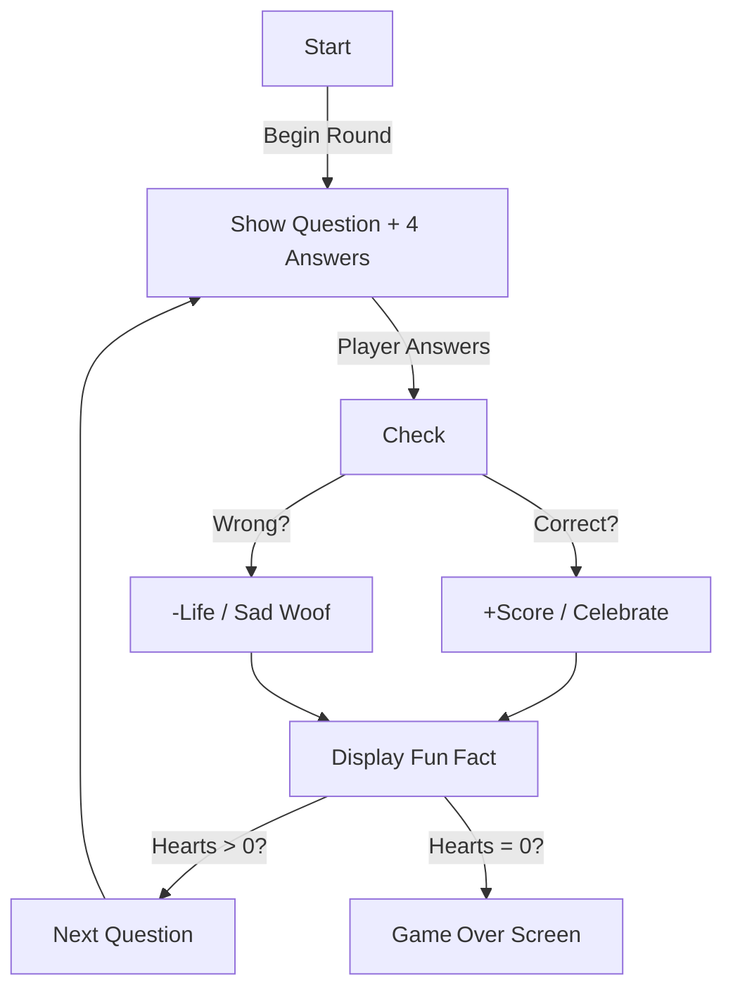

# Dog Trivia Quiz Game Concept

## Game Overview
This game is a **dog‑themed trivia quiz** aimed at children roughly **8–12 years old** (though fun for all ages).  
Players answer multiple‑choice questions about dogs—breeds, traits, and fun facts.  
The **core loop** is:

1. A question with four answers appears.  
2. The player taps an answer.  
3. Immediate feedback + a short **fun fact** shows.  
4. Score/lives update, then the next question loads.

The app will be rebuilt in **Flutter** for both iOS and Android.

---

## Core Gameplay Loop

---

## Question Content & Difficulty Progression
- **Easy → Medium → Hard** question pools.  
- Early rounds pull 80 % easy; later rounds mix in more hard questions.  
- **Adaptive difficulty**: streaks raise difficulty; mistakes drop it.  
- Levels unlock sequentially:

| Level | Theme | Difficulty | New Twist |
|-------|-------|------------|-----------|
| 1 | Common Breeds | Easy | No timer |
| 2 | Dog Jobs | Easy‑Med | 20 s timer |
| 3 | Rare Breeds | Medium | 15 s timer |
| 4 | Dog Anatomy | Med‑Hard | 12 s timer |
| 5 | Expert Trivia | Hard | 10 s timer, 2 lives |

---

## Scoring, Lives & Rewards
- **+10 pts** per correct (medium +15, hard +20).  
- **Streak bonus**: every 5 in‑a‑row ×2 multiplier.  
- **Lives**: 3 paws; wrong answer ⇒ –1 life.  
- **Win**: finish round with ≥1 life.  
- **Lose**: run out of lives before last question.  
- **Ranks/Badges** (total correct answers):

  | Correct | Title |
  |---------|-------|
  | 10 | *Chihuahua* |
  | 25 | *Pug* |
  | 50 | *Cocker Spaniel* |
  | 75 | *German Shepherd* |
  | 100 | *Great Dane* |

---

## Power‑Ups
| Icon | Power‑Up | Effect |
|------|----------|--------|
| 🦴 | **Chew 50/50** | Removes two wrong answers |
| 👀 | **Hint** | Shows a clue sentence |
| ⏲️ | **Extra Time** | +10 s on the timer |
| ➡️ | **Skip** | Skip question with no penalty |
| ❤️ | **Second Chance** | Refunds one lost life |

Earn via:
- Level completion rewards  
- Daily login streaks  
- Watching a parent‑gated rewarded ad (optional)

---

## Multiplayer Ideas
1. **Quiz Duel (Real‑time)** – both players answer same 10 questions; faster correct answers score higher.  
2. **Async Challenge** – send your finished scorecard to a friend; they replay identical quiz.  
3. **Pass‑and‑Play** – two kids share one device, alternate questions.  
4. **Leaderboards** – global & friends‑only high scores (GDPR/kid‑safe nicknames).  

---

## Additional Features
- **Daily Challenge**: one unique question set per day → bonus power‑up.  
- **Dogopedia**: collect breed cards & revisit unlocked fun facts.  
- **Avatar & Theme Unlocks**: earn new puppy icons and color themes.  
- **Sounds & Animations**: happy bark on correct; cartoon dog dances.  

---

## Monetization (Parent‑Friendly)
- *Optional* \$2.99 IAP: **Remove ads & double daily rewards**.  
- Cosmetic bundles (avatar packs).  
- Premium trivia packs (e.g. *Wild Animals*) behind a parent gate.

---

## Conclusion
With its **short, rewarding loop**, gentle difficulty curve, collectible badges, and optional multiplayer, *Pawsome Dog Trivia* is poised to delight kids and educate them about our four‑legged friends.  
Flutter ensures smooth cross‑platform delivery and store‑ready polish.

*Woof!* 🐾
